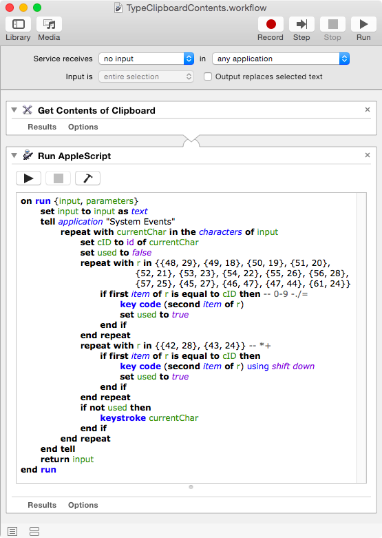
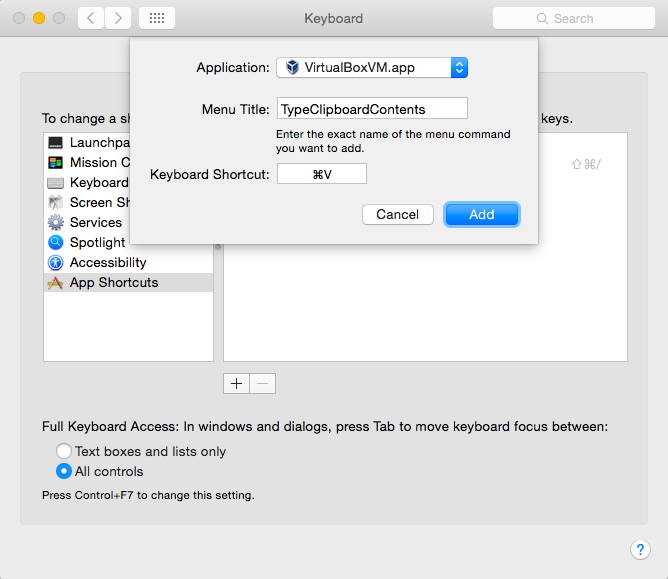

<meta http-equiv='Content-Type' content='text/html; charset=utf-8' />

Pasting In VirtualBox
=====================

Have you ever found yourself trying to paste a value into a VirtualBox
instance that's not running an OS with clipboard integration?

If you know the keyboard scancodes of the characters you'd like to
input, you can use the `controlvm` command of `VBoxManage` as follows:

`VBoxManage controlvm $VM_ID keyboardputscancode $DOWN_CODE $UP_CODE`

Setting `DOWN_CODE` to 10 and `UP_CODE` to 90 inserts the letter 'q'

That works, but even with some automation it's a bit of a pain.

Here's one way to do it under OS X without messing about with KeyCode
generation and a running terminal.

Create a Paste Service
----------------------

In Automator, create a new Service.

The service should receive no input.

The first action should be "Get Clipboard Contents"

The second action should be "Run AppleScript" with the following code:


on run {input, parameters}
    set input to input as text
    tell application "System Events"
        repeat with currentChar in the characters of input
            set cID to id of currentChar
            set used to false
            repeat with r in {{48, 29}, {49, 18}, {50, 19}, {51, 20}, {52, 21}, {53, 23}, {54, 22}, {55, 26}, {56, 28}, {57, 25}, {45, 27}, {46, 47}, {47, 44}, {61, 24}}
                if first item of r is equal to cID then -- 0-9 -./=
                    key code (second item of r)
                    set used to true
                end if
            end repeat
            repeat with r in {{42, 28}, {43, 24}} -- *+
                if first item of r is equal to cID then
                    key code (second item of r) using shift down
                    set used to true
                end if
            end repeat
            if not used then
                keystroke currentChar
            end if
        end repeat
    end tell
    return input
end run


Save the workflow as 'TypeClipboardContents'

Test The Service
----------------

1. Copy some text.
2. Open an application that allows text insertion.
3. Run the service from the Application's services submenu.

Keyboard Shortcut for VirtualBox
--------------------------------

Assuming the above steps worked for you, you can avoid having to use
the mouse by adding a keyboard shortcut for your service. I wanted to
use `⌘-V` as the shortcut, but only in VirtualBox.

1. Open System Preferences
2. Select the Keyboard pane. On some OS X versions it may be called
"Keyboard and Mouse"
3. Select the Shortcuts tab.
4. Select "App Shortcuts" from the panel on the left
5. Click the Plus(+) button
6. Select the VirtualBoxVM app. Mine was at:
`/Applications/VirtualBox.app/Contents/Resources/VirtualBoxVM.app`
7. Set Menu Title to 'TypeClipboardContents'
8. Set Keyboard Shortcut to `⌘-V`

Test The Shortcut
-----------------

1. Copy some text to the clipboard
2. Switch to the running VM of your choice
3. Type `⌘-V`

If it worked, great. If not, retrace your steps and try again!

Notes
-----

I revised the script on April 9th, 2016 to resolve an issue with
pasting of numbers and some
punctuation. [This post on Stack Overflow](http://apple.stackexchange.com/questions/142986/applescript-keystroke-ignoring-numbers)
was helpful in understanding why my earlier version of the service
failed to insert characters which might have been found on the numeric
keypad. The newer version of the script handles these troublesome
characters with manually chosen key codes from
`HIToolbox.framework/Versions/A/Headers/Events.h`
